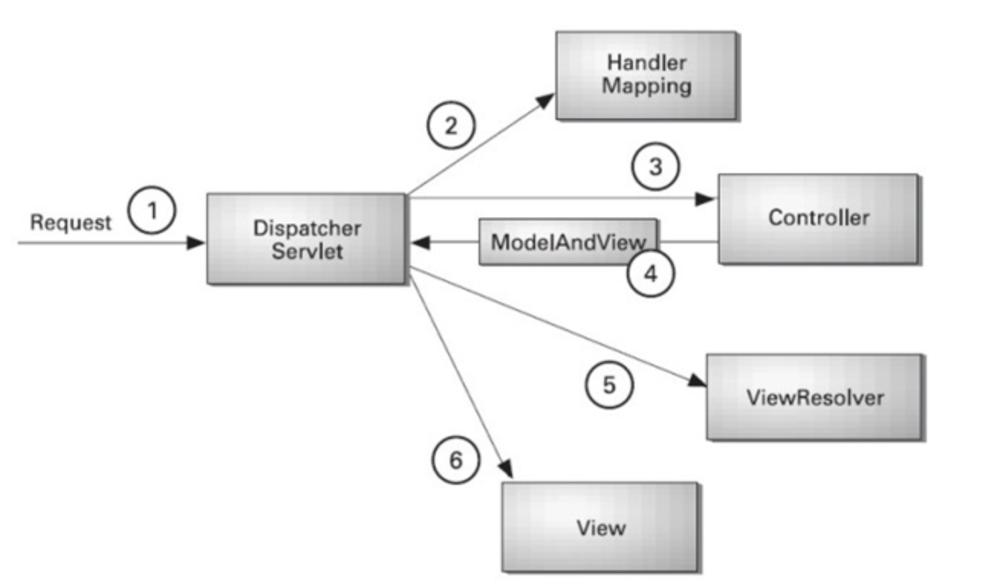

# About
This project is about demostarting the use of Controller. For more information on APIs and see its working please check deployment section.

# SpringMVC
- A Spring MVC provides an elegant solution to use MVC in spring framework by the help of DispatcherServlet. 
- DispatcherServlet is a class that receives the incoming request and maps it to the right resource such as controllers, models, and views.
- Model : A model contains the data of the application. A data can be a single object or a collection of objects.
- Controller : A controller contains the business logic of an application. Here, the @Controller annotation is used to mark the class as the controller.
- View : A view represents the provided information in a particular format.
- Front Controller : DispatcherServlet class works as the front controller. It is responsible to manage the flow of the Spring MVC application.

# Deployment
Click on the below links to see it all working.
Home Page: https://springmvc-app-github.herokuapp.com
 
Swagger UI: https://springmvc-app-github.herokuapp.com/swagger-ui.html

# Build
Follow below steps to deploy it on your system.
- Clone the repository
- Run mvc package
- Run java -jar target/dependency/webapp-runner.jar target/*.war (Or can deploy it using Tomcat or any other server.)

